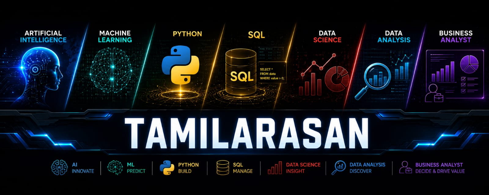

<div align="center">




###  B.Tech CSE Graduate (2026) SRM Institute of Science &amp; Technology, Chennai
*I build AI-based applications, ML pipelines and business-ready data dashboards — then ship them.*


</div>

<br>

<table width="100%">
<tr>
<td width="33%" align="center">
<h3>🧭</h3>
<b>Quick Nav</b><br><br>
<a href="#-ai--ml-projects">AI / ML</a> ·
<a href="#-data-analytics--power-bi">Analytics</a> ·
<a href="#-internship-programs">Internships</a> ·
<a href="#-web--misc">Web / Misc</a>
</td>
<td width="33%" align="center">
<h3>📫</h3>
<b>Reach Me</b><br><br>
<a href="mailto:tamilarsan538@gmail.com">Email</a> ·
<a href="https://www.linkedin.com/in/tamilarasan-a2466b274">LinkedIn</a> ·
<a href="https://www.infotact.in/tamilarasan">Portfolio</a>
</td>
<td width="33%" align="center">
<h3>⚡</h3>
<b>Status</b><br><br>
Open to Full-time / Internship roles in AI · ML · Data Science
</td>
</tr>
</table>

---

## 🧑‍💻 About

I'm a Computer Science graduate who likes turning messy, real-world data into things people can actually use — explainable ML models, live dashboards, and full-stack AI apps. Recent internships at **Infotact Solutions**, **Xylofy AI**, **Decode Labs**, and **Infosys Springboard** have taken me from raw CSVs to deployed Streamlit apps and SHAP-explained fraud detectors.

```text
class Tamilarasan:
    def __init__(self):
        self.role      = "AI/ML Engineer · Data Scientist · Data Analyst · Business Analyst"
        self.stack     = ["Python", "SQL", "TensorFlow", "XGBoost", "Power BI", "Streamlit"]
        self.focus     = ["Explainable AI", "Predictive Modeling", "Dashboards", "GenAI"]
        self.currently = "Building an AI-powered MTO extractor from piping isometric drawings"

    def get_in_touch(self):
        return "tamilarsan538@gmail.com"
```

<br>

<div align="center">


</div>

<div align="center">

</div>

---

## 🤖 AI / ML Projects

<details open>
<summary><b>Click to expand — 15 projects</b></summary>
<br>

| Project | What it does | Stack |
|---|---|---|
| 🧾 [**Isometric Drawing → Automated MTO Generator**](https://github.com/tamil1208/Isometric-Drawing-to-Automated-MTO-Generator) | Next.js + FastAPI app using Gemini Vision to extract Material Take-Off data from piping isometric drawings | `Next.js` `FastAPI` `Gemini Vision` |
| 🛡️ [**Real-Time Fraud Detection + Explainable AI**](https://github.com/tamil1208/Real-Time-Fraud-Detection-System-with-Explainable-AI-Live-Dashboard) | Multi-page Streamlit app for fraud analytics, risk scoring & SHAP explainability | `XGBoost` `SHAP` `Streamlit` |
| 🏭 [**PredictX — Industrial IoT Predictive Maintenance**](https://github.com/tamil1208/PredictX-Industrial-IoT-Predictive-Maintenance-Platform) | Predictive maintenance platform for industrial IoT sensor data | `Python` `IoT` `ML` |
| 📉 [**Customer Churn Prediction & Risk Segmentation**](https://github.com/tamil1208/Customer-Churn-Prediction-Risk-Segmentation) | Predicts churn risk and segments customers for retention strategy | `Python` `Scikit-learn` |
| 🖼️ [**Image Classification using CNN**](https://github.com/tamil1208/Image-Classification-using-CNN-) | Cats vs dogs image classifier built with convolutional neural networks | `Keras` `TensorFlow` `CNN` |
| 📄 [**AI Resume Screening System**](https://github.com/tamil1208/AI-Resume-Screening-System) | Automated resume screening & candidate-job matching pipeline | `Python` `NLP` |
| ✉️ [**Spam Email Detection**](https://github.com/tamil1208/Spam-Email-Detection) | Production-grade spam/ham email classifier with a Streamlit UI | `Python` `Streamlit` `ML` |
| 🏠 [**House Price Prediction System**](https://github.com/tamil1208/House-Price-Prediction-System) | Regression models predicting house prices from housing features | `Python` `Regression` |
| 💬 [**Sentiment Analysis System**](https://github.com/tamil1208/SentimentAnalysis_Tamilarasan) | NLP pipeline classifying text sentiment as positive/negative/neutral | `Python` `NLTK` |
| 🛒 [**Flipkart Reviews Sentiment Analysis**](https://github.com/tamil1208/Flipkart-Reviews-Sentiment-Analysis-using-Python) | Sentiment analysis on Flipkart product reviews | `Python` `NLP` |
| 💉 [**Anesthesia Prediction**](https://github.com/tamil1208/Anesthesia-Prediction) | End-to-end ML pipeline predicting anesthesia response from patient data | `Python` `EDA` `ML` |
| 🎓 [**Placement & Salary Prediction**](https://github.com/tamil1208/Placement-Prediction-using-Machine-Learning) | Random Forest model predicting placement outcome & expected salary | `Python` `Random Forest` |
| 🥇 [**Gold Price Prediction**](https://github.com/tamil1208/Gold-Price-Prediction) | Forecasts gold prices from historical market data | `Python` `Regression` |
| ⚡ [**Energy Consumption Prediction**](https://github.com/tamil1208/Machine_Learning_to_predict_Energy_Consumption-) | Forecasts energy usage using Linear Regression & Random Forest | `Python` `Scikit-learn` |
| 🎬 [**TMDb 5000 Movie Dataset Analysis**](https://github.com/tamil1208/TMDb-5000-Movie-Dataset-) | Trend analysis & success prediction across 5,000 films | `Python` `Pandas` |

</details>

---

## 📊 Data Analytics & Power BI

<details open>
<summary><b>Click to expand — 4 projects</b></summary>
<br>

| Project | What it does | Stack |
|---|---|---|
| 🎓 [**University Admissions & Superstore Analytics**](https://github.com/tamil1208/Project-2--University-Admissions-Superstore-Analytics) | 3-dashboard Power BI project: admissions trends, DAX visualizations, shipping cost analysis | `Power BI` `DAX` |
| 🛍️ [**Student Survey — Retail Store Analysis**](https://github.com/tamil1208/Power-BI-Student-Survey-Project---Retail-Store-Analysis) | Analyzes student spending across U.S. retail stores with RLS & interactive visuals | `Power BI` |
| ✈️ [**Airline Passenger Analytics Dashboard**](https://github.com/tamil1208/Airline-Passenger-Analytics-Dashboard---Power-BI) | Visualizes and analyzes airline passenger data | `Power BI` |
| 🎥 [**Netflix Dashboard**](https://github.com/tamil1208/Netflix-Dashboard) | Interactive dashboard exploring Netflix content trends with slicers & data modeling | `Power BI` `Jupyter` |

</details>

---

## 🎓 Internship Programs

<details open>
<summary><b>Click to expand — 6 projects</b></summary>
<br>

| Project | Program | What it covers |
|---|---|---|
| 🏭 [**Infotact Technical Internship Program**](https://github.com/tamil1208/INFOTACT-TECHNICAL-INTERNSHIP-PROGRAM) | Infotact Solutions | Manufacturing predictive maintenance dashboard, SHAP explainability |
| 🧪 [**Xylofy AI Internship Projects**](https://github.com/tamil1208/XYlofy-AI-Internship-Projects) | Xylofy AI | AI & data analytics coursework and projects |
| 🗄️ [**DecodeLabs — SQL Dashboard (Project 3)**](https://github.com/tamil1208/-decodelabs-sql-dashboard-project-3-) | Decode Labs | SQL-driven data analysis dashboard |
| 📈 [**DecodeLabs — Internship Project 4**](https://github.com/tamil1208/DecodeLabs-internship-project-4-) | Decode Labs | Data visualization deliverable |
| 🧹 [**DecodeLabs — Internship Week 1**](https://github.com/tamil1208/DecodeLabs-internship-week-1) | Decode Labs | Foundational data cleaning & analysis |
| 🛒 [**DecodeLabs — EDA Dashboard (Project 2)**](https://github.com/tamil1208/DecodeLabs-EDA-Data-Analyst-Project-2) | Decode Labs | Interactive EDA dashboard on 1,200 e-commerce transactions |

</details>

---

## 🌐 Web & Misc

<details open>
<summary><b>Click to expand — 4 projects</b></summary>
<br>

| Project | What it does | Stack |
|---|---|---|
| 🎵 [**Music Playlist**](https://github.com/tamil1208/Music-playlist) | Curated playlist app organized by mood, genre & preference | `JavaScript` `HTML/CSS` |
| 🌦️ [**Weather App**](https://github.com/tamil1208/tamil1208) | Simple weather lookup web app | `JavaScript` |
| 🌍 [**GDP Dashboard**](https://github.com/tamil1208/gdp-dashboard) | Dashboard visualizing GDP data across regions | `Python` `Streamlit` |
| 💼 [**Portfolio Website**](https://github.com/tamil1208/portfolio) | Source for my personal portfolio at infotact.in/tamilarasan | `HTML/CSS/JS` |

</details>

---

## 🧰 Tech Stack

<div align="center">


&nbsp;&nbsp;


&nbsp;&nbsp;


&nbsp;&nbsp;


</div>

---

## 💼 Experience Timeline

```text
2026 May – Present   ▸ Data Science & ML Intern — Infotact Solutions
2026 Jun – 2026 Jul  ▸ Data Science & ML Intern — Xylofy AI
2026 Apr – 2026 Jun  ▸ AI & Data Analytics Intern — Xylofy AI
2026 May – 2026 Jun  ▸ Data Analytics Intern — Decode Labs
2025 Oct – 2026 Jan  ▸ AI & ML Intern — Infosys Springboard
```

---

## 📈 Activity

<div align="center">

</div>

---

<div align="center">

### 🌐 Let's Connect

[](https://www.infotact.in/tamilarasan)
[](https://www.linkedin.com/in/tamilarasan-a2466b274)
[](https://github.com/tamil1208)
[](https://x.com/Tamil_012)
[](mailto:tamilarsan538@gmail.com)
[](https://leetcode.com/tamil_012)

<br>


</div>


<div align="center">


 


### 📍 Final-year CSE @ SRM Institute of Science &amp; Technology, Chennai
*I build AI-based applications, ML pipelines and data dashboards — then ship them.*
 


</div>

<br>

<table width="100%">
<tr>
<td width="33%" align="center">
<h3>🧭</h3>
<b>Quick Nav</b><br><br>
<a href="#-ai--ml-projects">AI / ML</a> ·
<a href="#-data-analytics--power-bi">Analytics</a> ·
<a href="#-internship-programs">Internships</a> ·
<a href="#-web--misc">Web / Misc</a>
</td>
<td width="33%" align="center">
<h3>📫</h3>
<b>Reach Me</b><br><br>
<a href="mailto:tamilarsan538@gmail.com">Email</a> ·
<a href="https://www.linkedin.com/in/tamilarasan-a2466b274">LinkedIn</a> ·
<a href="https://www.infotact.in/tamilarasan">Portfolio</a>
</td>
<td width="33%" align="center">
<h3>⚡</h3>
<b>Status</b><br><br>
Open to Full-time / Internship roles in AI · ML · Data Science
</td>
</tr>
</table>

---

## 🧑‍💻 About

I'm a Computer Science graduate who likes turning messy, real-world data into things people can actually use — explainable ML models, live dashboards, and full-stack AI apps. Recent internships at **Infotact Solutions**, **Xylofy AI**, **Decode Labs**, and **Infosys Springboard** have taken me from raw CSVs to deployed Streamlit apps and SHAP-explained fraud detectors.

```text
class Tamilarasan:
    def __init__(self):
        self.role      = "AI/ML Engineer · Data Scientist"
        self.stack     = ["Python", "SQL", "TensorFlow", "XGBoost", "Power BI", "Streamlit"]
        self.focus     = ["Explainable AI", "Predictive Modeling", "Dashboards", "GenAI"]
        self.currently = "Building an AI-powered MTO extractor from piping isometric drawings"

    def get_in_touch(self):
        return "tamilarsan538@gmail.com"
```

<br>

<div align="center">


</div>

<div align="center">

</div>

---

## 🤖 AI / ML Projects

<details open>
<summary><b>Click to expand — 15 projects</b></summary>
<br>

| Project | What it does | Stack |
|---|---|---|
| 🧾 [**Isometric Drawing → Automated MTO Generator**](https://github.com/tamil1208/Isometric-Drawing-to-Automated-MTO-Generator) | Next.js + FastAPI app using Gemini Vision to extract Material Take-Off data from piping isometric drawings | `Next.js` `FastAPI` `Gemini Vision` |
| 🛡️ [**Real-Time Fraud Detection + Explainable AI**](https://github.com/tamil1208/Real-Time-Fraud-Detection-System-with-Explainable-AI-Live-Dashboard) | Multi-page Streamlit app for fraud analytics, risk scoring & SHAP explainability | `XGBoost` `SHAP` `Streamlit` |
| 🏭 [**PredictX — Industrial IoT Predictive Maintenance**](https://github.com/tamil1208/PredictX-Industrial-IoT-Predictive-Maintenance-Platform) | Predictive maintenance platform for industrial IoT sensor data | `Python` `IoT` `ML` |
| 📉 [**Customer Churn Prediction & Risk Segmentation**](https://github.com/tamil1208/Customer-Churn-Prediction-Risk-Segmentation) | Predicts churn risk and segments customers for retention strategy | `Python` `Scikit-learn` |
| 🖼️ [**Image Classification using CNN**](https://github.com/tamil1208/Image-Classification-using-CNN-) | Cats vs dogs image classifier built with convolutional neural networks | `Keras` `TensorFlow` `CNN` |
| 📄 [**AI Resume Screening System**](https://github.com/tamil1208/AI-Resume-Screening-System) | Automated resume screening & candidate-job matching pipeline | `Python` `NLP` |
| ✉️ [**Spam Email Detection**](https://github.com/tamil1208/Spam-Email-Detection) | Production-grade spam/ham email classifier with a Streamlit UI | `Python` `Streamlit` `ML` |
| 🏠 [**House Price Prediction System**](https://github.com/tamil1208/House-Price-Prediction-System) | Regression models predicting house prices from housing features | `Python` `Regression` |
| 💬 [**Sentiment Analysis System**](https://github.com/tamil1208/SentimentAnalysis_Tamilarasan) | NLP pipeline classifying text sentiment as positive/negative/neutral | `Python` `NLTK` |
| 🛒 [**Flipkart Reviews Sentiment Analysis**](https://github.com/tamil1208/Flipkart-Reviews-Sentiment-Analysis-using-Python) | Sentiment analysis on Flipkart product reviews | `Python` `NLP` |
| 💉 [**Anesthesia Prediction**](https://github.com/tamil1208/Anesthesia-Prediction) | End-to-end ML pipeline predicting anesthesia response from patient data | `Python` `EDA` `ML` |
| 🎓 [**Placement & Salary Prediction**](https://github.com/tamil1208/Placement-Prediction-using-Machine-Learning) | Random Forest model predicting placement outcome & expected salary | `Python` `Random Forest` |
| 🥇 [**Gold Price Prediction**](https://github.com/tamil1208/Gold-Price-Prediction) | Forecasts gold prices from historical market data | `Python` `Regression` |
| ⚡ [**Energy Consumption Prediction**](https://github.com/tamil1208/Machine_Learning_to_predict_Energy_Consumption-) | Forecasts energy usage using Linear Regression & Random Forest | `Python` `Scikit-learn` |
| 🎬 [**TMDb 5000 Movie Dataset Analysis**](https://github.com/tamil1208/TMDb-5000-Movie-Dataset-) | Trend analysis & success prediction across 5,000 films | `Python` `Pandas` |

</details>

---

## 📊 Data Analytics & Power BI

<details open>
<summary><b>Click to expand — 4 projects</b></summary>
<br>

| Project | What it does | Stack |
|---|---|---|
| 🎓 [**University Admissions & Superstore Analytics**](https://github.com/tamil1208/Project-2--University-Admissions-Superstore-Analytics) | 3-dashboard Power BI project: admissions trends, DAX visualizations, shipping cost analysis | `Power BI` `DAX` |
| 🛍️ [**Student Survey — Retail Store Analysis**](https://github.com/tamil1208/Power-BI-Student-Survey-Project---Retail-Store-Analysis) | Analyzes student spending across U.S. retail stores with RLS & interactive visuals | `Power BI` |
| ✈️ [**Airline Passenger Analytics Dashboard**](https://github.com/tamil1208/Airline-Passenger-Analytics-Dashboard---Power-BI) | Visualizes and analyzes airline passenger data | `Power BI` |
| 🎥 [**Netflix Dashboard**](https://github.com/tamil1208/Netflix-Dashboard) | Interactive dashboard exploring Netflix content trends with slicers & data modeling | `Power BI` `Jupyter` |

</details>

---

## 🎓 Internship Programs

<details open>
<summary><b>Click to expand — 6 projects</b></summary>
<br>

| Project | Program | What it covers |
|---|---|---|
| 🏭 [**Infotact Technical Internship Program**](https://github.com/tamil1208/INFOTACT-TECHNICAL-INTERNSHIP-PROGRAM) | Infotact Solutions | Manufacturing predictive maintenance dashboard, SHAP explainability |
| 🧪 [**Xylofy AI Internship Projects**](https://github.com/tamil1208/XYlofy-AI-Internship-Projects) | Xylofy AI | AI & data analytics coursework and projects |
| 🗄️ [**DecodeLabs — SQL Dashboard (Project 3)**](https://github.com/tamil1208/-decodelabs-sql-dashboard-project-3-) | Decode Labs | SQL-driven data analysis dashboard |
| 📈 [**DecodeLabs — Internship Project 4**](https://github.com/tamil1208/DecodeLabs-internship-project-4-) | Decode Labs | Data visualization deliverable |
| 🧹 [**DecodeLabs — Internship Week 1**](https://github.com/tamil1208/DecodeLabs-internship-week-1) | Decode Labs | Foundational data cleaning & analysis |
| 🛒 [**DecodeLabs — EDA Dashboard (Project 2)**](https://github.com/tamil1208/DecodeLabs-EDA-Data-Analyst-Project-2) | Decode Labs | Interactive EDA dashboard on 1,200 e-commerce transactions |

</details>

---

## 🌐 Web & Misc

<details open>
<summary><b>Click to expand — 4 projects</b></summary>
<br>

| Project | What it does | Stack |
|---|---|---|
| 🎵 [**Music Playlist**](https://github.com/tamil1208/Music-playlist) | Curated playlist app organized by mood, genre & preference | `JavaScript` `HTML/CSS` |
| 🌦️ [**Weather App**](https://github.com/tamil1208/tamil1208) | Simple weather lookup web app | `JavaScript` |
| 🌍 [**GDP Dashboard**](https://github.com/tamil1208/gdp-dashboard) | Dashboard visualizing GDP data across regions | `Python` `Streamlit` |
| 💼 [**Portfolio Website**](https://github.com/tamil1208/portfolio) | Source for my personal portfolio at infotact.in/tamilarasan | `HTML/CSS/JS` |

</details>

---

## 🧰 Tech Stack

<div align="center">


&nbsp;&nbsp;


&nbsp;&nbsp;


&nbsp;&nbsp;


</div>

---

## 💼 Experience Timeline

```text
2026 May – Present   ▸ Data Science & ML Intern — Infotact Solutions
2026 Jun – 2026 Jul  ▸ Data Science & ML Intern — Xylofy AI
2026 Apr – 2026 Jun  ▸ AI & Data Analytics Intern — Xylofy AI
2026 May – 2026 Jun  ▸ Data Analytics Intern — Decode Labs
2025 Oct – 2026 Jan  ▸ AI & ML Intern — Infosys Springboard
```

---

## 📈 Activity

<div align="center">

</div>

---

<div align="center">

### 🌐 Let's Connect

[](https://www.infotact.in/tamilarasan)
[](https://www.linkedin.com/in/tamilarasan-a2466b274)
[](https://github.com/tamil1208)
[](https://x.com/Tamil_012)
[](mailto:tamilarsan538@gmail.com)
[](https://leetcode.com/tamil_012)

<br>


</div>
 
